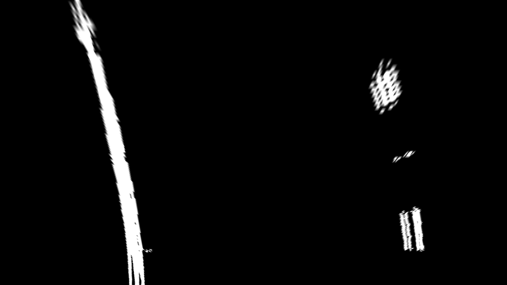

**Advanced Lane Finding Project**

###Camera Calibration

####1. Briefly state how you computed the camera matrix and distortion coefficients. Provide an example of a distortion corrected calibration image.

The code for this step is contained in file [calibration.py](calibration.py). I have created class `ChessboardCalibrator` to automate calibration process. I feed chessobaord images to this class via `add_chessboard_image` function. This functions accepts image and expected pattern size. Then I detect chessboard corners in the image with `cv2.findChessboardCorners`. If they are found I add them to `__image_points` list. 

Then I prepare object points. Assuming that found image points are mapped to (x, y, 0) points on a plane. Object points are added to `__object_points` list.

After all calibration images were processed I used `__object_points` and `__image_points` to compute the camera calibration and distortion coefficients using the `cv2.calibrateCamera()` function.  I applied this distortion correction to the test image using the `cv2.undistort()` function and obtained this result:


`ChessboardCalibrator` is also able to save and load computed coefficients to file. Thus actual computation takes place only once.

There were also a few minor issues while developing this part of project:

1. Some images had size not equal to 720x1280. 
2. OpenCV was not able to find chessboard pattern on 2 images. Documentation for `findChessboardCorners` [states](http://docs.opencv.org/2.4/modules/calib3d/doc/camera_calibration_and_3d_reconstruction.html#cv2.findChessboardCorners):
 
   >The function requires white space (like a square-thick border, the wider the better) around the board to make the detection more robust in various environments. Otherwise, if there is no border and the background is dark, the outer black squares cannot be segmented properly and so the square grouping and ordering algorithm fails.

   This does not hold for those mentioned images. 

For both cases I just skip _bad_ images. Because there is more than enough calibration data to do that.

###Pipeline (single images)

####1. Provide an example of a distortion-corrected image.
To demonstrate this step I just create an instance of ChessboardCalibrator, giving it a calibration data file created at previous step and call `calibrator.undistort(image)`


####2. Describe how (and identify where in your code) you used color transforms, gradients or other methods to create a thresholded binary image.  Provide an example of a binary image result.
I used a combination of direction, magnitude and brightness/contrast thresholds to generate a binary image ([threshold_lines function](https://github.com/AM5800/self_driving_car/blob/master/advanced_lanes_detection/threshold.py#L30). 
First I converted input image to HSV colorspace and taken second channel. This is beneficial because:
* This channel is more robust to lighting conditions change
* On a simple grayscale image yellow lines are almost invisible

Following steps are pretty self-explainatory, except for contrast step. Intuition here is that lane lines are specially made to have very high contrast. So instead of color thresholding I tried to increase image contrast by a factor of 100. This, of course leads to almost white image so I also decreased image brightness.

Here's an example of my output for this step.


####3. Describe how (and identify where in your code) you performed a perspective transform and provide an example of a transformed image.

The code for my perspective transform is all located in [Warper](https://github.com/AM5800/self_driving_car/blob/master/advanced_lanes_detection/warp.py#L6) class. It has two self describing functions: `warp` and `unwarp`. Coefficients for transformation are hardcoded and look like this:

```
top = 460 # Conrols height of upper segment of trapeze
bottom = 660 # Conrols height of bottom segment of trapeze
xcenter = img_shape[1] / 2
top_half_width = 107 # Half width of top part of trapeze
bottom_half_width = 650

self.src = np.float32(
    [[xcenter - top_half_width, top],
     [xcenter + top_half_width, top],
     [xcenter + bottom_half_width, bottom],
     [xcenter - bottom_half_width, bottom]])

self.dst = np.float32(
    [[0, 0],
     [img_shape[1], 0],
     [img_shape[1], img_shape[0]],
     [0, img_shape[0]]])

```
I verified that my perspective transform was working as expected by warping an image where car is moving in the center and lane lines are straight. After warping such image lane lines should were almost vertical.


####4. Describe how (and identify where in your code) you identified lane-line pixels and fit their positions with a polynomial?

To identify lines I merge 2 consecutive warped and thresholded frames into one image:

This helps to detect dashed lines and removes final image jittering. Then I compute histogram and detect two highest peaks in it (keeping in mind that there should be some gap between them).

After peaks detected I launch a sliding window from each peak's X-coordinate. This hepls to separate one line from another and to separate lane pixels from other pixels. Result is separate groups of pixels for left and right lines. Those pixels are then fitted to 2nd degree polynomial via `numpy.polyfit` function.
To ensure that found lines are actually lane lines I execute 2 simple sanity checks:
1. Distance between lines should be at least 500 pixels
2. Curvature radius differs no more than 2 times

If new lines fail on those checks or no new lines found at all - I just leave previous lines on scene.


####5. Describe how (and identify where in your code) you calculated the radius of curvature of the lane and the position of the vehicle with respect to center.

Curvature radius is computed by this formula:
[formula]

Car offset is computed by this formula: 

####6. Provide an example image of your result plotted back down onto the road such that the lane area is identified clearly.


---

###Pipeline (video)

####1. Provide a link to your final video output.  Your pipeline should perform reasonably well on the entire project video (wobbly lines are ok but no catastrophic failures that would cause the car to drive off the road!).

Here's a [link to my video result](https://youtu.be/tPlNkCYSdYI)

---

###Discussion

####1. Briefly discuss any problems / issues you faced in your implementation of this project.  Where will your pipeline likely fail?  What could you do to make it more robust?

If we compare this project to very first lane detection one - I don't think it improved a lot:
There are still lots of "hyperparameters" such as magnitude threshold which should be picked by hand. And they might be wrong if environment changes signficantly - like rain or snow or night. 

This algorithm will most likely fail if there are other cars infront.

Changing lane is still a problem - algorithm assumes there are only 2 lane lines out there. But to change lane we need to see 3 lines.

While watching challenge videos I have noticed that I have to adjust some of my parameters for them.
So to work furhter I would like to automate parameter search with grid, like in previous works. We can create validation set by marking zones where lines should be detected and where not. And find such hyperparameters that maximize that score.

I also think that image segmentation with Neural Networks will be very good here. The only drawback - we need a lot of marked data for this.
