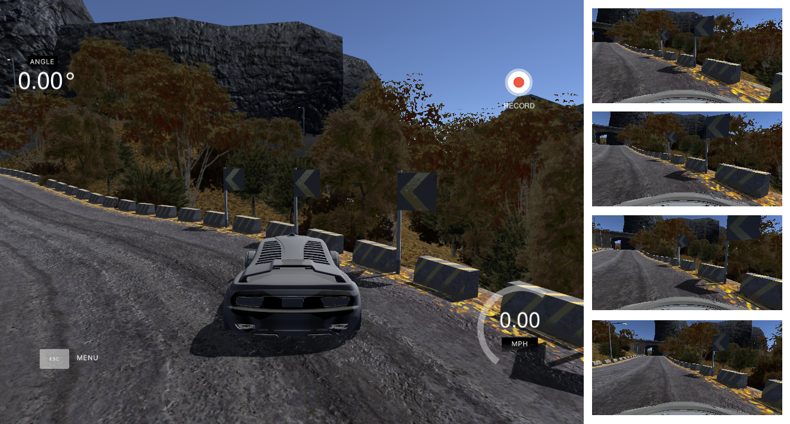
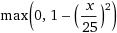

# Problem overview
As part of the [Udacity self-driving car nanodegree program](http://udacity.com/drive) I was given a task to write an AI capable of driving car in a specially built simulator. Position and orientation of the car - those are parameters unknown to the model. It only allowed to see an image from the frontal camera mounted on the car. Given an image from a camera and constant throttle it should predict steering wheel angle. 

Here is what my result looks like
https://www.youtube.com/watch?v=eJDFs58AD04

# Solution approach
This problem is approached in terms of supervised learning. I.e we build some model(models), feed it sample images with marked steering angle and hope it will be able to drive. In this particular environment we have an ability to generate data by ourselves - by driving a car in a simulator while recording required data. So the first step is to gather that data

# Dataset creation
I use two separate datasets in this project. Fist, "training set" is used to train several models. Second, "validation set" is used to evaluate each model's performance and choose the best model. And finally I can always launch simulator and let my model drive.

## Training set
To create a training set one can simply drive both provided test tracks in the center. But this is not enough: if a model leaves perfect trajectory (and it will) - it won't know what to do. That's why I also add some recovery maneuvers:
I move car to the edge of road and back. But then I delete frames where car is moving towards the edge. Since network sees our input and will eventually try to mimic our behavior - it is a bad idea to show it how to get off the road. But if it happens - model will know what to do. Total training set size is 4992 images.

Typical recovery maneuver:

## Validation set
Early experiments showed that it is quite hard to evaluate model based only on validation data. Two models with almost same validation score might behave totally different - one driving smoothly and other - driving in zigzags, loosing control and eventually leaving the test track. This makes automatic model selection very hard. 

To address this issue I first tried to increase size of the validation set. But it didn't help. I think this is because model needs only few frames to lose control. And even though mean square error for such frames will be high - it will be unnoticeable when there are 6000 other frames which model had driven perfectly.

Solution that worked is to decrease validation set size. I was monitoring how models are driving on the test track and if I saw some place where it was frequently misbehaving - I made a few validation frames with expected steering angle. 
I ended up with only 21 total images in validation set. Despite such small size my confidence in validation score is very high now. I am now sure that almost any model with validation score less than 0.1 is able to drive. This made automatic model selection very simple and reproducible.

## Image preprocessing
I have tried to convert images to HSV colorspace. Intuition behind this decision is that change in the lighting conditions will mostly affect one channel - V. And all three channels are usually affected in RGB model making it harder for model to learn the dependency between channels. 

Another technique is image normalization (R/255-0.5; G/255-0.5; B/255-0.5). In theory it should speed up model convergence because model has to spend less effort adapting for constantly changing distribution in the input data. In practice I haven't noticed any speed up in covergence. Perhaps Batch Normalization (discussed later) is just more beneficial.

# Training
I have tried lots of models with different parameters. But they have a lot in common:
- Models use Convolutional layers with relu activation
- Last layer contains single "node" - steering angle
- Mean square error is used as validation loss function

To minimize MSE I use Adam optimizer. And to find best network architecture and parameters I use grid search. In particular, with grid search I am optimizing:
- Network architecture
- Dropout value
- Use of Batch Normalization
- Image preprocessing technique

To reduce amount of RAM required to store the whole dataset, I store it as a list of paths to images. And when it comes to training I load only one batch of images with keras fit_generator.

Grid usually contains a lof of nodes. To speedup grid search even further I used early stopping. Also, I am checking model after each epoch and if it has the best global validation performance - I save it.

Next I will describe some notable networks.

## AlexNet
AlexNet is very simple yet effective and proven architecture for image recognition. And our problem is just about that - we receive an image from the camera and we should find high-level features that correspond to, for example, road boundaries. And then we will feed those high level features to fully connected layers that will predict steering angle.

In this case the network starts with 4 convolution layers and ends with 2 hidden layers connected to a regressor. Each convolution layer uses 'relu' activation and is followed by max pooling layer. There is also batch normalization layer between each layer. BN layer serves two purposes: first, it makes models to converge faster (and for really deep models like inceptionV3 it is super important). Second, it works as a regularizer. Since the mean and bias are learned from batches statistics - net never sees the same input twice. Actual placement of BN layer is arguable, but I met recommendations to place them after each convolution layer.

Dropout also added to last hidden layer to even further prevent overfitting.

[AlexNet scheme](img/alexnet.png)

## AlexNet modifications
I also tried some modifications of alexnet. First, I have added dropout layers between convolutions. This should prevent co-adaptations between those layers. And second, I have removed max pooling layers. And increased convolution stride respectively. This reduces input dimensionality(as max pooling does) but in a more accurate and efficient way compared to just dropping 8 out of 9 pixels.

## InceptionV3
Another interesting architecture that I tried - is inception network from google. This network is also used in image processing and it showed very high score in ImageNet competition. There are  also other ImageNet winning networks such as VGG or ResNet. But they have much more parameters. Which is undesirable in a real time application.
Keras framework has built-in function for creating this network: keras.applications.inceptionv3
This network is designed for image classification. So I have changed last layer to be regressor.

[Mindblowing scheme](img/inception.png)

## Throttle
First I used default throttle value. But soon I realized that it is too small for second track with it's steep uphill climbs. So I came with this empirical formula:

where x is current speed of vehicle

Important thing about this formula is that it has value 1.0 when current vehicle speed is zero. And then throttle gently decrases as car reaches maximum speed of 25 miles per hour. 

Why not just set throttle to maximum? Well, this will lead to increased vehicle speed. And I didn't train my models for that.

# Results and conclusion
In the end all described networks can drive a car in a simulator. I haven't found any difference between alexnet modifications except that simple alexnet was training slightly faster on average.

Inception network showed good results on validation dataset. But very poor results in actual driving. It was always doing zigzags which usually led it into the wall. One of the reasons for this might be the fact that it was taking 10 times more to process each frame. And because of this delay new steering angles come with too big delay. To proove that version I have added 0.09 second delay to a model that drives good. And it ended zigzagging too. This is very unfortunate, since I was planning to do much more with this network. Transfer learning for example.

So final model uses alexnet architecture, batch normalization and dropout = 0.7

# Appendix: project structure
* [model.py](model.py) - contains NN definition and functions to train it
* [drive.py](drive.py) - controls simulation
* [dataset.py](dataset.py) - utiliy functions for dataset loading and transformation
* [grid.py](grid.py) - utiliy functions for grid manipulations
* [model.json](model.json) - final model structure definition
* [model.h5](model.h5) - final model's weights
* [model.cfg](model.cfg) - stores dataset name which was used during training
