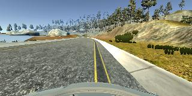
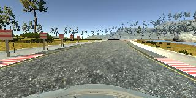

# Project report: Behavioral cloning
## Project structure
* [model.py](model.py) - contains NN definition and functions to train it
* [drive.py](drive.py) - controls simulation
* [dataset.py](dataset.py) - utiliy functions for dataset loading and transformation
* [model.json](model.json) - final model structure definition
* [model.h5](model.h5) - final model's weights
* [model.cfg](model.cfg) - stores dataset name which was used during training
* [model.png](model.png) - final model structure graph

## Dataset preparation
Dataset consists of training data and validation data. 
Test set is not generated because testing in the simulator effectively replaces it.
Training and validation dataset are stored separately. This is done to improve reproducibility of results

Only center images were used and I didn't use second track in training. This was done intentionally to check how well model can handle absolutely new kind of environment

### Training data
To obtain training data I used provided simulator. Driving 2 or 3 laps trying to stay ideally in the center.
After first experiments I also added to the train set some recovery maneuvers:

While recording is off, move to the road edge. Then enable recording and immediately return to the center of the road

Total images in train set: **3036**

Above is an example of recovery as seen by central camera

### Validation data
Validation data is also generated with the simulator. But I was driving in reverse direction.
If I were driving in the same direction - I would have a high chance to obtain very similar images in train and validation set. 
This could lead to overfitting in validation set.

No recovery maneuvers were executed in validation set. Only riding in the center

Total images in validation set: **6045**
Validation set is made larger to be able to better control changes in validation accuracy.

### Data augmentation
I have used only one augmentation technique: converting image to HSV colorspace. Mostly because of V channel. Since it is more robust to changes in the lighting conditions.

_Please note_: [drive.py](drive.py) was modified to automatically augment images.

## Training
So far I have tried 2 network architectures. 
First is AlexNet-like network and second is VGG-like. 
Both networks are not "100% as described in original papers". They rather look like AlexNet and VGG. But for simplicity I will refer to them as AlexNet and VGG further.

To find best network architecture and hyperparameters I used grid search.
With grid search I optimized:
* learning rate
* network architecture
* dropout
* use of batch normalization
* dataset augmentation method

I am not using **fit_generator** because on my machine all images can freely fit to memory. And it is much faster than reload them on each epoch

## Anti-overfitting measures
Dropout and BatchNormalization are used to reduce overfitting. 
BatchNormalization also helps to speed up covergence.

## Final network description
AlexNet and VGG showed comparable results on validation dataset. But AlexNet runs up to 3 times faster. And model performance is very important in such real-time task as car driving. So my final net is AlexNet

With grid I have found that best results are achieved when BatchNormalization os turned on and dropout is set to 0.7

My AlexNet consists of 4 Convolution layers, each followed by relu, BN and max pool layers.
After that go two hidden layers with relu, batch normalization and dropout.
And final layer is a single value - predicted steering angle.

See [model.png](model.png) for full network graph (it is too big to include in report)

I use Adam optimizer and **mean square error** as loss function

## Conclusion
Final model is able to drive test track almost perfectly - it never hits yellow lines. However it fails to drive the second track at all.
There are only two explanations for this: 
1. model has "learned"(overfitted) first track and can't drive anywhere else.
2. training only on the first track is just not enough to drive on the second.

I have also noticed that model performance depends much more on what I show to the network, rather than which network architecture/hyperparameters I use. 

I am going to address above issues in the next iteration of this project.
