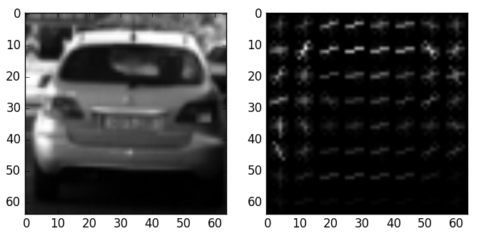

###Histogram of Oriented Gradients (HOG)

####1. Explain how (and identify where in your code) you extracted HOG features from the training images.

The code for this step is contained in ...

I started by reading in all the `vehicle` and `non-vehicle` images.  Here is an example of one of each of the `vehicle` and `non-vehicle` classes:

I then explored different color spaces and different `skimage.hog()` parameters (`orientations`, `pixels_per_cell`, and `cells_per_block`). Here is an example using the `grayscale` color space and HOG parameters of `orientations=9`, `pixels_per_cell=(8, 8)` and `cells_per_block=(2, 2)`:

####2. Explain how you settled on your final choice of HOG parameters.

I tried various combination of parameters and estimated their efficiency through testing on validation dataset. Manual grid search, if you like.

I didn't try much parameters combination because I reached 99% accuracy pretty fast.

After reaching 99% accuracy I have concentrated on feature number optimization. So I ended with ... HOG-features per 64x64 image

####3. Describe how (and identify where in your code) you trained a classifier using your selected HOG features (and color features if you used them).

For classifier I used HOG, color histogram and spatial binning features. Total number of features is ...
`CombiningImageFeatureExtractor` class allows me to combine any feature extractors in various combinations. And again, I estimated feature extractors' efficiency through validation error

###Sliding Window Search

####1. Describe how (and identify where in your code) you implemented a sliding window search.  How did you decide what scales to search and how much to overlap windows?

I have used 3 types of windows. Each image size for detecting vehicles on different distances. Sizes of windows were chosen as powers of 2. Namely 32x32, 64x64, 128x128. This is beneficial because:
* Integral number of such windows can fit to image width (1280)
* Classifier is trained for 64x64 images. So by using window of same size I can avoid scaling
* Up/Down scaling is more efficient and lossless if both image sizes are powers of 2

![alt text][image3]

####2. Show some examples of test images to demonstrate how your pipeline is working.  What did you do to optimize the performance of your classifier?

Ultimately I searched on two scales using YCrCb 3-channel HOG features plus spatially binned color and histograms of color in the feature vector, which provided a nice result.  Here are some example images:

![alt text][image4]
---

### Video Implementation

####1. Provide a link to your final video output.  Your pipeline should perform reasonably well on the entire project video (somewhat wobbly or unstable bounding boxes are ok as long as you are identifying the vehicles most of the time with minimal false positives.)
Here's a [link to my video result](./project_video.mp4)

####2. Describe how (and identify where in your code) you implemented some kind of filter for false positives and some method for combining overlapping bounding boxes.

I recorded the positions of positive detections in each frame of the video.  From the positive detections I created a heatmap and then thresholded that map to identify vehicle positions.  I then used `scipy.ndimage.measurements.label()` to identify individual blobs in the heatmap.  I then assumed each blob corresponded to a vehicle.  I constructed bounding boxes to cover the area of each blob detected.  

Here's an example result showing the heatmap from a series of frames of video, the result of `scipy.ndimage.measurements.label()` and the bounding boxes then overlaid on the last frame of video:

### Here are six frames and their corresponding heatmaps:

![alt text][image5]

### Here is the output of `scipy.ndimage.measurements.label()` on the integrated heatmap from all six frames:
![alt text][image6]

### Here the resulting bounding boxes are drawn onto the last frame in the series:
![alt text][image7]

---

###Discussion

####1. Briefly discuss any problems / issues you faced in your implementation of this project.  Where will your pipeline likely fail?  What could you do to make it more robust?

Here I'll talk about the approach I took, what techniques I used, what worked and why, where the pipeline might fail and how I might improve it if I were going to pursue this project further.  

