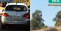
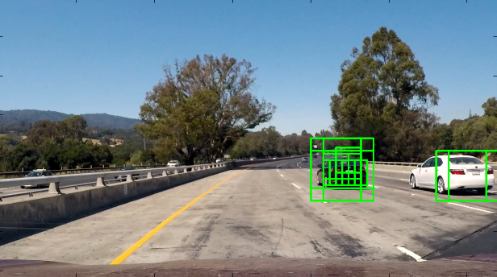

###Histogram of Oriented Gradients (HOG)

####1. Explain how (and identify where in your code) you extracted HOG features from the training images.

The code for this step is contained in file [feature_extractor.py](https://github.com/AM5800/self_driving_car/blob/master/vehicle_detection/feature_extractor.py#L18)

I started by reading in all the `vehicle` and `non-vehicle` images.  Here is an example of one of each of the `vehicle` and `non-vehicle` classes:

I then explored different color spaces and different `skimage.hog()` parameters (`orientations`, `pixels_per_cell`, and `cells_per_block`). Here is an example using the `grayscale` color space and HOG parameters of `orientations=9`, `pixels_per_cell=(8, 8)` and `cells_per_block=(2, 2)`:

####2. Explain how you settled on your final choice of HOG parameters.

I tried various combination of parameters and estimated their efficiency through testing on validation dataset. Manual grid search, if you like.

I didn't try much parameters combination because I reached 99% accuracy pretty fast.

After reaching 99% accuracy I have concentrated on feature number optimization. So I ended with *1764* HOG-features per 64x64 image. 

Grayscale colorspace was chosen because it minimizes number of features and images are still very well recognizable

####3. Describe how (and identify where in your code) you trained a classifier using your selected HOG features (and color features if you used them).

I used [SVM](https://github.com/AM5800/self_driving_car/blob/master/vehicle_detection/vehicle_classifier.py#L26) as classifier. 
Next I selected [HOG, color histogram and spatial binning features](https://github.com/AM5800/self_driving_car/blob/master/vehicle_detection/classify.py#L35) as input features(Total number of features is *2580*), then I [normalized](https://github.com/AM5800/self_driving_car/blob/master/vehicle_detection/vehicle_classifier.py#L41) data. And finally I [fed it to the SVM](https://github.com/AM5800/self_driving_car/blob/master/vehicle_detection/vehicle_classifier.py#L44)

I experimented a lot with different feature extractors. 
Grayscale hog alone gives 97-98% accuracy. By adding other mentioned features I was able to achieve 99% accuracy on validation dataset

###Sliding Window Search

####1. Describe how (and identify where in your code) you implemented a sliding window search.  How did you decide what scales to search and how much to overlap windows?

I have used 3 types of windows. Each image size for detecting vehicles on different distances. Sizes of windows were chosen as powers of 2. Namely [32x32](https://github.com/AM5800/self_driving_car/blob/master/vehicle_detection/pipeline.py#L12), [64x64](https://github.com/AM5800/self_driving_car/blob/master/vehicle_detection/pipeline.py#L25), [128x128](https://github.com/AM5800/self_driving_car/blob/master/vehicle_detection/pipeline.py#L38). This is beneficial because:
* Integral number of such windows can fit to image width (1280)
* Classifier is trained for 64x64 images. So by using window of same size I can avoid scaling
* Up/Down scaling is more efficient and lossless if both image sizes are powers of 2

Next are example images, showing each layer's position and density:

[Main search window function](https://github.com/AM5800/self_driving_car/blob/master/vehicle_detection/pipeline.py#L51)

####2. Show some examples of test images to demonstrate how your pipeline is working.  What did you do to optimize the performance of your classifier?

Ultimately I searched on three scales using grayscale single-channel HOG features plus spatially binned color and histograms of color in the feature vector, which provided a nice result. 

I tried to find an optimal balance between accuracy and evaluation speed. This was mostly a trial and error process: I captured few frames from the video with different car positions. And tried to make my far/middle/near windows detect it by changing sizes of the windows, overlapping and height.

Here are some example images:

### Video Implementation

####1. Provide a link to your final video output.  Your pipeline should perform reasonably well on the entire project video (somewhat wobbly or unstable bounding boxes are ok as long as you are identifying the vehicles most of the time with minimal false positives.)
Here's a [link to my video result](./project_video_result.mp4)

####2. Describe how (and identify where in your code) you implemented some kind of filter for false positives and some method for combining overlapping bounding boxes.

I recorded the positions of positive detections in each frame of the video. After that for each 10 consequtive frames I computed [heatmap](https://github.com/AM5800/self_driving_car/blob/master/vehicle_detection/pipeline.py#L99) like this:

1. all boxes within one frame are painted with one color
2. "local heatmaps" from p1 were added together to form final heatmap

Then I thresholded resulting heatmap and used `scipy.ndimage.measurements.label()` to identify individual blobs in the heatmap. I then assumed each blob corresponded to a vehicle.  I constructed bounding boxes to cover the area of each blob detected.

Here's an example result showing the heatmap from a series of frames of video, the result of `scipy.ndimage.measurements.label()` and the bounding boxes then overlaid on the last frame of video:

Here is a sample image from video:

Heatmap integrated on this and 9 previous frames:

Output of `scipy.ndimage.measurements.label()`

And resulting image with bounding boxes:

---

###Discussion

####1. Briefly discuss any problems / issues you faced in your implementation of this project.  Where will your pipeline likely fail?  What could you do to make it more robust?

The hardest part in this project were sliding window and heatmap adjustments. For heatmap I first tried approach described in lectures (where each detection contributed in the final heatmap). But this yielded poor results for me. Because for some car I had 10+ detections in one frame. While for other 1-2. It was very hard to find optimal threshold value to remove false positives and not remove actual cars. 

Also you can notice in the video that cars that slowly approach from right are not detected until their rear part appears. This is due to the lack of such images of cars in the training set. Sometimes it is detected (mostly due to hist features, I think) sometimes not.

Provided implementation will fail:
- If tried to run in real-time (It is very slow right now)
- It will definitely has problems detecting cars that are differently oriented (for example on a crossroads)
- There might be other obstacles on road - people, cyclists, bikers, road works or even other types of cars (buses, trucks etc)
- During rain reflections might confuse algorithm.

I have some ideas to improve:
- Cars don't appear from nowhere. They appear from sides if they overtake or from "horizon" if we a catching up. So it might be a good speedup if we try to track new cars in mentioned regions and not in the whole image
- Compute HOG features once for each frame as mentioned in lectures
- Add some jittering to training set
- After car is detected - try to search it's exact bounds by launching additional search window in region

